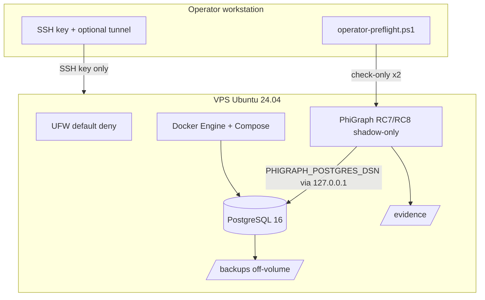

# GRDI RC8 Staging Provisioning Runbook

Procedimiento **provider-agnostic** para aprovisionar un VPS staging reproducible que soporte el ejercicio RC7→RC8 (baseline RC7, backup, upgrade RC8, cutover auditado).

| Flag | Valor en este paquete |
|------|------------------------|
| `STAGING` | `NOT_PROVISIONED` |
| `CUTOVER` | `NOT_EXECUTED` |
| `PRODUCTION` | `OUT_OF_SCOPE` |

**Baselines obligatorios**

| Rol | Git commit | Core | PostgreSQL migrations |
|-----|------------|------|------------------------|
| RC7 baseline | `44ba1cc08ee007183822b629f37ce00fd6a56db8` | `4.1.0-rc.7` | `001` only |
| RC8 target | `d309c6f0d692752f2f54b912b764d71fb9de2e18` | `4.1.0-rc.8` | `001` → `002` |
| Cutover tooling | (en `main@d309c6f`) | — | `scripts/grdi_rc8_cutover.py` **v1.2.0** |

**Runbooks relacionados**

- Baseline RC7: `GRDI_RC7_STAGING_BASELINE_RUNBOOK.md`
- Cutover RC7→RC8: `GRDI_RC7_TO_RC8_POSTGRES_CUTOVER_RUNBOOK.md`
- Manifiesto entorno: `examples/grdi_rc8_staging_environment.example.json`

**No modificar** `docker-compose.staging.yml` (SQLite API/worker). PostgreSQL aislado: `deploy/staging/docker-compose.grdi-cutover.yml`.

---

## 1. Arquitectura staging



| Componente | Política |
|------------|----------|
| OS | Ubuntu 24.04 LTS |
| Compute | ≥ 2 vCPU, ≥ 4 GiB RAM, 40–80 GiB SSD |
| Docker | Engine + Compose plugin |
| PostgreSQL | 16.14 pin (`postgres:16.14-bookworm@sha256:64154d0…`) — [release 16.14](https://www.postgresql.org/about/news/postgresql-184-1710-1614-1518-and-1423-released-3297/) |
| Python | 3.12 + `[postgres]` |
| Client tools | `psql`, `pg_dump`, `pg_restore` |
| PostgreSQL exposure | **Nunca** `0.0.0.0:5432`; opcional `127.0.0.1:5432` en host para túnel SSH |
| Remote DB access | Solo SSH local forwarding (`ssh -L`); UFW **no** abre 5432; producción fuera de alcance |
| API | Bind `127.0.0.1` o red privada; `PHIGRAPH_SHADOW_ONLY=true` |
| Conectores | `PHIGRAPH_REAL_CONNECTORS_ENABLED=false` |
| Auth | `PHIGRAPH_RECEIPT_SIGNING_KEY` obligatoria (fail-closed staging) |

---

## 2. Requisitos VPS (placeholders)

Sustituir placeholders; **no** registrar IPs reales en el repositorio.

| Placeholder | Descripción |
|-------------|-------------|
| `VPS_PROVIDER` | DonWeb, Hetzner, etc. |
| `VPS_HOST` | FQDN o IP pública |
| `VPS_REGION` | Región |
| `OPERATOR_USER` | Usuario sudo sin login root directo |
| `OPERATOR@VPS_HOST` | Acceso SSH por clave |

---

## 3. DNS (opcional)

Registro `A`/`AAAA` hacia `VPS_HOST` (ej. `phigraph-staging.example.com`). TLS reverse proxy (Caddy/nginx) fuera de alcance de este paquete; API sigue en localhost durante cutover.

---

## 4. Usuario operador y SSH

```bash
# On VPS as root bootstrap (once)
adduser OPERATOR_USER
usermod -aG sudo,docker OPERATOR_USER
mkdir -p /home/OPERATOR_USER/.ssh
chmod 700 /home/OPERATOR_USER/.ssh
# Install operator public key into authorized_keys (chmod 600)
passwd -l root   # disable root password login
```

Clave SSH del operador en workstation; **no** almacenar claves privadas en el repo.

Túnel documentado (workstation):

```bash
ssh -N -L 5433:127.0.0.1:5432 OPERATOR_USER@VPS_HOST
# PHIGRAPH_POSTGRES_DSN → localhost:5433
```

---

## 5. UFW sin lockout

Orden seguro:

```bash
sudo ufw default deny incoming
sudo ufw default allow outgoing
sudo ufw allow OpenSSH
# Confirm SSH session still works in a second terminal before:
sudo ufw enable
sudo ufw status verbose
```

**No** `ufw allow 5432`. PostgreSQL permanece interno / localhost.

---

## 6. Instalar Docker

Seguir documentación oficial Docker Engine para Ubuntu 24.04. Verificar:

```bash
docker --version
docker compose version
sudo usermod -aG docker OPERATOR_USER
```

---

## 7. PostgreSQL client + Python 3.12

```bash
sudo apt-get update
sudo apt-get install -y postgresql-client python3.12 python3.12-venv
python3.12 --version
pg_dump --version
pg_restore --version
```

---

## 8. Estructura de directorios en VPS

```text
/opt/phigraph/                          # RC8 checkout @ d309c6f
/opt/phigraph/deploy/staging/           # compose + .env.staging (600)
/var/backups/phigraph-grdi-rc8-staging/ # pg_dump custom (off Docker volume)
/var/evidence/phigraph-grdi-rc8-staging/  # JSON reports, manifiestos
../phigraph-rc7-baseline/               # detached worktree @ 44ba1cc (temporary)
```

Permisos:

- `.env.staging`: `chmod 600`, owner `OPERATOR_USER`
- backups/evidence: `750`, owner operador

---

## 9. Gestión de secretos

1. Copiar `deploy/staging/.env.staging.example` → `deploy/staging/.env.staging` (gitignored vía `.env.*`).
2. Generar passwords locales (`openssl rand -hex 32`); **nunca** commitear.
3. `PHIGRAPH_POSTGRES_DSN` solo en sesión o `.env.staging` en VPS.
4. No imprimir DSN en logs/tickets; usar `database_identity_hash` de `--check-only`.

Variables mínimas: ver `.env.staging.example`.

---

## 10. Despliegue PostgreSQL (compose aislado)

```bash
cd /opt/phigraph
cp deploy/staging/.env.staging.example deploy/staging/.env.staging
# edit placeholders
chmod 600 deploy/staging/.env.staging
docker compose -f deploy/staging/docker-compose.grdi-cutover.yml up -d
docker compose -f deploy/staging/docker-compose.grdi-cutover.yml ps
```

Validar healthcheck y que **no** hay bind `0.0.0.0:5432`:

```bash
ss -ltn | grep 5432 || true
```

Crear marcador server-side de entorno (una sola fila; el fixture **no** lo modifica):

```bash
psql "$PHIGRAPH_POSTGRES_DSN" -f deploy/staging/sql/001_environment_metadata.sql
psql "$PHIGRAPH_POSTGRES_DSN" -c "
INSERT INTO phigraph_environment_metadata (environment, environment_id, fixture_loading_allowed)
VALUES ('staging', gen_random_uuid(), true);"
```

Tras cutover o promoción a producción, revocar fixture loading:

```bash
psql "$PHIGRAPH_POSTGRES_DSN" -c "
UPDATE phigraph_environment_metadata SET fixture_loading_allowed = false;"
```

---

## 11. Preflight VPS (read-only)

```bash
deploy/staging/preflight.sh --repo-root /opt/phigraph
```

No instala ni corrige automáticamente. Opcional checksums:

```bash
deploy/staging/preflight.sh \
  --artifact-sha256 deploy/staging/docker-compose.grdi-cutover.yml=SHA256
```

---

## 12. Despliegue RC7 baseline

Seguir **`GRDI_RC7_STAGING_BASELINE_RUNBOOK.md`** completo:

1. Worktree detached `44ba1cc`.
2. Migración `001` only + `ensure_legacy_core_ledger_table`.
3. Fixtures `create_grdi_rc7_staging_fixture.py`.
4. `--check-only` → exit 2 / `NO_GO`.

---

## 13. Backup (obligatorio antes de RC8)

Ver baseline runbook §9. Almacenar fuera de `phigraph-grdi-cutover-pgdata`.

---

## 14. Upgrade código a RC8

```bash
cd /opt/phigraph
git fetch origin
git checkout d309c6f0d692752f2f54b912b764d71fb9de2e18
python3.12 -m pip install -e ".[postgres,api]"
git rev-parse HEAD
```

**No** ejecutar `bootstrap_postgres_scoped_schema` manualmente antes del cutover auditado salvo que el runbook de cutover lo indique en la ventana de mantenimiento.

---

## 15. Preflight operador (check-only ×2)

Workstation (PowerShell):

```powershell
$env:PHIGRAPH_ENVIRONMENT = 'staging'
.\deploy\staging\operator-preflight.ps1 -SshTunnel '5433:127.0.0.1:5432'
```

Garantías: dos `--check-only`, fingerprints estables, redacción DSN, **sin** `--apply`.

---

## 16. Cutover (posterior — no ejecutar en este paquete)

Cuando staging esté provisionado y ventana acordada, seguir **`GRDI_RC7_TO_RC8_POSTGRES_CUTOVER_RUNBOOK.md`**:

1. Bloqueo escrituras.
2. Backup verificado.
3. `--check-only` final.
4. `--apply --acknowledge-global-migration` (global only).
5. `--verify`.
6. Smoke shadow-only.

**CUTOVER = NOT_EXECUTED** hasta completar ese runbook explícitamente.

---

## 17. Verify y smoke

Post-apply: `grdi_rc8_cutover.py --verify` + smoke API shadow (sin conectores). Documentar en manifiesto cutover (`grdi_rc8_cutover_manifest`).

---

## 18. Rollback

Forward-only migrations: **restore backup** a nueva base o PITR. No SQL downgrade parcial. Ver cutover runbook §20.

---

## 19. Recolección de evidencias

Archivar en `evidence_directory`:

- `preflight.sh` output
- `check_only_01.json`, `check_only_02.json`
- Manifiesto entorno (copia de example JSON, sin secretos)
- Manifiesto cutover post-operación
- SHA-256 backup + `pg_restore --list` excerpt

---

## 20. Desmantelamiento seguro

1. Exportar evidencia y backups.
2. `docker compose ... down -v` (destruye volumen PG — confirmar backups).
3. Revocar claves SSH staging.
4. Destruir VPS en panel provider.
5. Actualizar manifiesto `status: DECOMMISSIONED`.

---

## 21. Inventario de artefactos reutilizados

| Artefacto existente | Uso en staging GRDI |
|---------------------|---------------------|
| `scripts/grdi_rc8_cutover.py` v1.2.0 | Preflight / apply / verify |
| `docs/operations/GRDI_RC7_TO_RC8_POSTGRES_CUTOVER_RUNBOOK.md` | Cutover post-provision |
| `migrations/postgresql/001_*.sql`, `002_*.sql` | Schema RC7/RC8 |
| `tests/grdi_rc7_legacy_fixtures.py` | Patrones (no import en ops) |
| `docker-compose.staging.yml` | **No** usado para PG cutover (SQLite) |
| `docker-compose.yml` / `mvp` | Referencia shadow-only, no PG |
| `DeploymentSettings` | `PHIGRAPH_SHADOW_ONLY`, fail-closed staging key |

| Artefacto nuevo | Propósito |
|-----------------|-----------|
| `deploy/staging/docker-compose.grdi-cutover.yml` | PostgreSQL 16 aislado |
| `deploy/staging/.env.staging.example` | Plantilla secretos |
| `deploy/staging/preflight.sh` | Auditoría VPS read-only |
| `deploy/staging/operator-preflight.ps1` | Check-only dual desde workstation |
| `scripts/create_grdi_rc7_staging_fixture.py` | Seed RC7 legacy sintético |
| `GRDI_RC7_STAGING_BASELINE_RUNBOOK.md` | Baseline reproducible |
| `examples/grdi_rc8_staging_environment.example.json` | Manifiesto infra |

**Puertos publicados (compose GRDI):** solo `127.0.0.1:5432→5432` (túnel SSH). Nunca `0.0.0.0`. UFW no abre 5432. Conexión remota solo vía `ssh -L`. Producción fuera de alcance.
**Volúmenes:** `phigraph-grdi-cutover-pgdata`.
**Healthcheck:** `pg_isready`.
**Usuario contenedor:** postgres (imagen oficial).
**Auto-migración:** `EvidenceLedger` / `CoreV3Service` **no** migran al init; riesgo RC8 es invocar `bootstrap_postgres_scoped_schema` explícitamente o `--apply` antes de backup.

---

## 22. Threat model

| Amenaza | Impacto | Mitigación en este paquete |
|---------|---------|----------------------------|
| PostgreSQL expuesto en `0.0.0.0:5432` | Exfiltración / ransomware | Compose sin bind público; UFW; preflight `ss` |
| Robo de backup `.dump` | Pérdida confidencialidad ledger | Off-volume + cifrado; permisos 700; no PII en fixtures |
| Fuga DSN en logs/tickets | Acceso no autorizado DB | Redacción cutover tool; PS1 elimina env; manifiesto usa hash |
| Confusión staging/production | Cutover en prod | Scripts rechazan `production`/`prod`; manifiesto `OUT_OF_SCOPE` |
| Auto-upgrade accidental RC8 | Baseline inválido | RC7 worktree; fixture script rechaza `002` presente |
| Rollback incompleto | Estado híbrido 001/002 | Restore full backup; no DELETE parcial |
| Pérdida de evidencia | No auditabilidad | Directorio evidence obligatorio; fingerprints |
| Doble ejecución cutover | Corrupción / duplicados | Manifiesto + backup age gate; ventana mantenimiento |
| Acceso concurrente en ventana | Drift inventario | Bloqueo escrituras § cutover runbook |
| Ejecución accidental `--apply` | Migración no auditada | `operator-preflight.ps1` check-only; tests estáticos |
| Conectores reales | Efectos externos | `PHIGRAPH_REAL_CONNECTORS_ENABLED=false` enforced |

---

## 23. Controles producción

- Ningún script acepta `PHIGRAPH_ENVIRONMENT=production`.
- `.env.staging` gitignored (`.env.*` rule).
- Sin credenciales en compose/runbooks/tests.
- Sin `--apply` en preflight scripts.
- Sin `repair_chain()` en tooling ops.
- Baseline y cutover documentan shadow-only.

---

## 24. Validación local del paquete (mantenedores)

Instalación alineada con CI (incluye `openpyxl` vía extra `app`):

```powershell
py -3.12 -m pip install -e ".[api,benchmark,dev,auth,app,postgres]"
```

Antes de merge futuro (fuera de este entregable):

```text
git diff --check
py -3.12 -m compileall -q src scripts tests
py -3.12 -m pytest -q
docker compose -f deploy/staging/docker-compose.grdi-cutover.yml config
shellcheck deploy/staging/preflight.sh
pwsh -NoProfile -Command "[void][scriptblock]::Create((Get-Content deploy/staging/operator-preflight.ps1 -Raw))"
```

**REVIEW_REQUIRED** — staging no provisionado; cutover no ejecutado.
