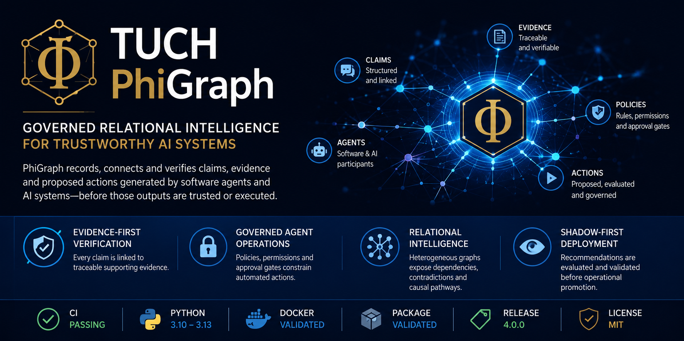

# TUCH PhiGraph Core 4.0.0

## Governed Relational Intelligence for Trustworthy AI and Software-Agent Operations

**Author:** Walter Calmels  
**Organization:** TUCH Systems  
**Location:** Santiago, Chile  
**Repository:** `wcalmels/phigraph`  
**Release:** 4.0.0  
**Document:** Investor and Strategic Overview  
**Date:** July 2026

---

## Executive Summary

TUCH PhiGraph is a governed relational-intelligence platform created to help organizations record, connect, verify, and control claims, evidence, policies, and proposed actions generated by software agents and AI systems.

PhiGraph Core 4.0.0 consolidates the platform into a structured technical release with a canonical protocol, governance services, graph intelligence, agent workflows, deployment components, domain packs, validation assets, and a Python SDK.

The platform is designed around a simple operating principle: an AI output is not automatically trusted or executed. It becomes an auditable candidate claim or action, linked to evidence, policies, approvals, and verification results.

## Investment Thesis

AI adoption is accelerating faster than the control systems required to govern it. Enterprises increasingly need a layer that can connect model outputs to evidence, enforce operational policies, preserve decision traceability, and prevent partial or contradictory signals from being elevated into authoritative outcomes.

PhiGraph addresses this control gap as a reusable platform layer rather than a single-purpose application. Its architecture is applicable to AI agents, enterprise software, cybersecurity, logistics, industrial operations, software assurance, GraphRAG, compliance, and controlled automation.

The commercial opportunity lies in positioning PhiGraph as infrastructure for evidence-bounded AI: a governance and relational-intelligence layer that sits between data, models, agents, enterprise systems, and operational execution.

## The Problem PhiGraph Solves

Modern AI systems can generate recommendations, classifications, code changes, operational decisions, and proposed actions at high speed. The critical enterprise challenge is not only whether a model can produce an answer, but whether that answer is supported, authorized, consistent, traceable, and safe to promote.

Conventional systems frequently fragment evidence, authorization, monitoring, and execution across separate tools. This makes it difficult to answer basic governance questions: What evidence supports this claim? Which policy permits this action? Who approved it? What contradicted it? What happened after execution?

PhiGraph creates a unified relational control plane for these questions.

## Core Value Proposition

- Evidence-first verification: claims and proposals are connected to traceable evidence rather than accepted as authoritative by default.
- Governed agent operations: permissions, policies, approval gates, idempotency, and receipts constrain how automated systems move from analysis to action.
- Relational intelligence: heterogeneous graphs expose dependencies, contradictions, corridors, anomalies, and candidate causal pathways across complex systems.
- Shadow-first deployment: models, recommendations, and actions can be evaluated before operational promotion.
- Cross-domain architecture: domain packs and adapters enable reuse across cybersecurity, fleet, fraud, maintenance, mining, and general enterprise workflows.

## Platform Architecture

- Protocol Layer - canonical structures for claims, evidence, policies, verification results, action proposals, approvals, receipts, and status transitions.
- Core Governance Layer - evidence ledgers, policy evaluation, identity and authorization, idempotency, rate limiting, telemetry, backend abstractions, and runtime services.
- Relational-Intelligence Layer - heterogeneous graph construction, spectral analysis, graph kernels, corridor analysis, localization, multiscale analysis, entity resolution, and projected root-cause analysis.
- Agent and Workflow Layer - data quality, modeling, simulation, validation, recommendation, governance consensus, safety gating, shadow deployment, outcome learning, and reliability workflows.
- Deployment Layer - FastAPI services, Streamlit interfaces, workers, SQLite and PostgreSQL pathways, Docker packaging, and environment-based configuration.
- SDK and Domain Layer - Python SDK, adapters, domain packs, benchmark tooling, and validation workflows.

## Verified Engineering Evidence

- PhiGraph Core 4.0.0 has a reproducible automated test suite comprising 117 tests.
- The GitHub Actions CI pipeline has passed across Python 3.10, 3.11, 3.12, and 3.13.
- Docker image construction has passed in CI.
- The packaged Python wheel has passed an isolated installation and import smoke test.
- The repository includes release packaging, deployment configurations, API services, SDK boundaries, governance documentation, migration assets, and validation fixtures.
- The release includes synthetic benchmarks, CIC-IDS2017 validation assets, and LANL reduced-fixture graph construction workflows.

## Commercial Applications

- AI Agent Governance - verification, approval, and audit of agent-generated claims and actions.
- Software Assurance - controlled evaluation of code changes, patches, model runs, and repository evidence.
- Cybersecurity - graph-based correlation, anomaly analysis, attack-path context, and shadow-first recommendations.
- Industrial and Mining Operations - relational analysis of equipment, processes, maintenance signals, cost drivers, and operational dependencies.
- Logistics and Fleet Intelligence - cost control, route and asset relationships, anomaly detection, and governed operational recommendations.
- Enterprise Graph Intelligence - evidence-aware GraphRAG, entity resolution, contradiction detection, and decision traceability.
- Compliance and Audit - durable evidence ledgers, policy decisions, approvals, and execution receipts.

## Business Model Potential

- Enterprise licensing for PhiGraph Core and domain-specific packages.
- Managed cloud or private-cloud deployment for regulated and industrial customers.
- Implementation, integration, and governance consulting.
- Premium domain modules such as PhiGraph Cyber, PhiGraph Code, PhiGraph Logistics, and PhiGraph Industrial.
- SDK and API subscriptions for software vendors and AI-agent platforms.
- Validation, audit, and controlled-deployment services.

## Competitive Differentiation

- PhiGraph combines graph intelligence with explicit governance rather than treating them as separate products.
- The platform is model-agnostic: language models can provide explanations or assistance without becoming the sole detector or authority.
- Its shadow-first operating model supports controlled adoption in environments where direct autonomous execution is unacceptable.
- Its evidence and receipt model is designed to make decisions reconstructable, reviewable, and attributable.
- The same core protocol can support multiple domains, creating platform economics rather than a single vertical product.

## Go-to-Market Strategy

- Phase 1 - demonstrate PhiGraph through a focused cybersecurity and software-assurance use case with measurable verification workflows.
- Phase 2 - deploy private pilots in logistics, mining, maintenance, and enterprise AI governance.
- Phase 3 - package reusable domain modules and managed deployment options.
- Phase 4 - establish PhiGraph as a transversal governance and relational-intelligence layer for AI-enabled enterprise software.

## Strategic Positioning

PhiGraph is positioned at the intersection of AI governance, graph intelligence, software assurance, and controlled automation.

Its value is not limited to generating predictions. The platform is designed to govern how information becomes a claim, how a claim becomes a decision, and how a decision becomes an action.

This makes PhiGraph relevant to organizations that need to adopt AI while preserving evidence, policy control, accountability, and operational discipline.

## Conclusion

TUCH PhiGraph Core 4.0.0 provides a substantial technical foundation for governed relational intelligence. It combines a canonical protocol, evidence-led operations, graph analytics, agent workflows, deployment services, domain extensibility, and reproducible engineering validation.

The platform offers a credible path toward enterprise products in AI governance, cybersecurity, software assurance, industrial operations, logistics, and controlled automation.

PhiGraph represents an opportunity to build a reusable control layer for trustworthy AI systems: one that connects intelligence to evidence, policy, approval, and accountable execution.

---

## Contact

**TUCH Systems**  
**Santiago, Chile**  
**Web:** `phi47.cl`  
**Repository:** `github.com/wcalmels/phigraph`
